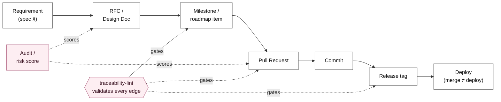

# RFC-0001: EADOS — the agentic delivery operating system

- **Status:** Accepted (direction ratified by [ADR-0011](../adr/0011-eados-phase-based-delivery-operating-system.md)); this is the living design.
- **Date:** 2026-06-21
- **Author:** Enterprise Project Architect (tech-lead role)
- **Reviewers:** Owner (`@danielPoloWork`), security-auditor (enterprise lens §9)
- **Related:** ADR-0011 (the pivot), ADR-0012 (the rename), `orchestrator/os/` (the specs this
  elaborates), `AGENTS.md` §3/§6/§7, the enterprise delivery-roles guide.

> **How to read this.** This RFC is the master design for evolving the factory into EADOS. It
> ratifies *what* we build and *why*; the normative *data* lives in the three machine-readable
> specs under [`orchestrator/os/`](../../orchestrator/os/README.md). Milestones (§12) sequence
> the build so the existing factory never breaks. This document is dogfooding the `design`
> phase it defines — it is the kind of artifact the OS will produce and gate.

---

## 0. Summary

EADOS turns a one-shot repository **factory** into a **phase-based delivery operating system**:
an opt-in pipeline — `init → design → plan → scaffold → audit → refactor` — over the unchanged,
data-driven core. Generation (`scaffold`) becomes one phase among several. The system is
**state-driven** (a persistent, reference-based manifest is the state; a thin deterministic
checker computes legal transitions), routing is **deterministic** (phase + ownership map, never
fuzzy intent), and **humans hold every terminal gate**. The whole thing is *data + gates*, so
adding a domain, a role, a workflow, or a gate is editing a validated YAML file — never a
special case in code.

## 1. Context & problem

The factory (formerly EAAO) interviews a maintainer, renders a governed repository, and hands
off — "EADOS steps back" (`AGENTS.md` §3). That is excellent for day zero and nothing else. The
owner wants to govern the **whole delivery lifecycle** of enterprise projects (for top-tier
companies): design docs/RFCs, roadmaps from RFCs, scaffolding, ongoing audit/risk, and refactor
of *existing* codebases — with agents that reason as distinct professional figures (Product /
Engineering / Delivery, per the delivery-roles guide).

Two tempting framings are both wrong:

- a **monolithic 360° orchestrator** — boils the ocean and erodes the data-driven genericity
  that makes the factory reusable; and
- **stripping roadmap/milestone into loose, unconnected modules** — loses end-to-end delivery
  and the traceability backbone.

A structured architecture review (12 areas: role routing, persona-vs-authority, workflow engine,
ownership, Git/PR/CI, review, release, manifest evolution, orchestration, traceability,
extensibility) concluded the system should be **declarative data enforced by mechanical gates,
state-driven**, reusing the factory's existing strengths rather than rewriting them.

## 2. Goals / non-goals

**Goals.** (G1) One opt-in phase pipeline over the unchanged core. (G2) The roadmap stays as a
phase — the delivery backbone. (G3) Resident *as a capability*: the generated `AGENTS.md` stays
the source of truth. (G4) A new **domain/target axis** as data, parallel to language profiles.
(G5) A **persistent, reference-based** manifest as the single source of delivery state. (G6) Four
machine-readable OS artifacts (`workflow`, `authority`, `git`, traceability) with schemas + gates.
(G7) Every role interaction anchored to an artifact + a gate (no "multi-agent theater").

**Non-goals.** (N1) A runtime kernel/scheduler/event bus — "Operating System" here means the
**opinionated governance layer that decides how work flows**, declarative and human-gated, not a
process runtime. (N2) Autonomous merge/publish authority for agents. (N3) Replacing Git as the
source of truth for *content*. (N4) Reworking the existing generation templates' behavior (the
`scaffold` phase is today's renderer, untouched).

## 3. The phase model (state machine)

The pipeline is a state machine defined as data in
[`orchestrator/os/workflow/workflow.yaml`](../../orchestrator/os/workflow/workflow.yaml). States
are phases; transitions are **gated and never automatic**; each phase is opt-in, resumable, and
owned by a role.

```mermaid
flowchart LR
  classDef data fill:#eef2ff,stroke:#8893c4,color:#1b2147;
  classDef state fill:#eef7ee,stroke:#3a9a3a,color:#123012;
  classDef phase fill:#ffffff,stroke:#555555,color:#111111;

  LP["Language Profiles"]:::data
  DP["Domain / Target Profiles<br/>software · game · mobile"]:::data
  MAN[("Persistent Delivery Manifest<br/>shared state · reference-based")]:::state

  LP --> MAN
  DP --> MAN
  MAN --> INIT

  INIT["init<br/><i>architect</i>"]:::phase -->|"manifest-valid · H"| DESIGN["design · RFC<br/><i>tech-lead</i>"]:::phase
  DESIGN -->|"rfc-approved · H"| PLAN["plan · roadmap<br/><i>producer</i>"]:::phase
  PLAN -->|"roadmap-covers-rfcs · H"| SCAFFOLD["scaffold · generate<br/><i>architect</i>"]:::phase
  SCAFFOLD -->|"consistency-lint + self-review"| AUDIT["audit · risk<br/><i>security-auditor</i>"]:::phase
  AUDIT -->|"risk-register · H"| REFACTOR["refactor · brownfield<br/><i>architect</i>"]:::phase
  PLAN -. resumable .-> DESIGN
```



`· H` marks a **human-gated** transition (the owner confirms). The "engine" is not a runtime: it
is a deterministic checker that reads the manifest's current state + this spec and returns the
legal transitions; the agent **proposes**, the gates validate, the human confirms the H-gates.
Generation is decoupled from governance because `scaffold` only reads the manifest and writes
files — phases communicate through shared state, never by calling each other.

Per-domain overlays adapt the machine: a `game` inserts an `asset-pipeline-review` state and a
`hardware-budget` gate (RAM/GPU/framerate); a `mobile` adds `store-compliance`.

## 4. Role & authority model (persona ≠ authority)

Today a role is *only* a persona + procedure (`agent/*.md`). The OS separates three concerns:

| Concern | Where | Example |
|---|---|---|
| **Persona** (behavior/voice) | `agent/*.md` | "a pragmatic security engineer…" |
| **Authority** (draft/approve/own) | [`authority.yaml`](../../orchestrator/os/authority/authority.yaml) | reviewer may *comment* an RFC, only tech-lead *approves* |
| **Workflow context** (phases) | `authority.yaml` `roles[].phases` | producer operates only in `plan` |

This is what lets a role exist **without** authority over an artifact — the keystone that makes
routing deterministic (§5) and review real (§6). The roles map the delivery guide's three
pillars: **Product** (`product-manager`/game-designer), **Engineering** (`enterprise-architect`,
`tech-lead`, `reviewer`, `security-auditor`), **Delivery** (`producer`/TPM, `release-manager`).
The two new roles (`product-manager`, `producer`) gain personas in M2.

## 5. Ownership model (CODEOWNERS → authority map)

EADOS generalizes `.github/CODEOWNERS` from "who reviews" to "who may draft / approve / owns",
as the machine-readable `ownership_map` in `authority.yaml`: `path glob → role + action`. This is
the **routing substrate** — the acting role for a change is a function of the touched path, not
of fuzzy intent. The authority gate (M2) rejects a change that touches a glob the actor does not
own. When the domain changes (software → game), the map is *derived from the domain profile*
(game adds `assets/**` under a different owner), so ownership propagates as data.

## 6. Git / PR / CI / release integration

The existing Git governance (`AGENTS.md` §6) is encoded as data in
[`git.yaml`](../../orchestrator/os/git/git.yaml): Conventional Commits, branch naming,
one-change-per-PR / one-PR-at-a-time, **agent drafts / human opens / human squash-merges**. The
OS adds:

- **PR ↔ RFC ↔ milestone cross-links** (`pr.required_crosslinks`): a PR body must reference its
  RFC and milestone; the roadmap item flips its checkbox in the same PR (an existing rule). These
  edges feed the traceability graph (§7).
- **CI gates as uniform descriptors.** lint/test/security-scan/build are one shape
  (`{id, kind, runs, blocking, required_for}`); a red gate **blocks the transition** *and* returns
  to the implementing role as a fix-forward task — the agent never mutates the gate to pass
  (disabling tests/warnings is an existing anti-pattern).
- **Merge ≠ deploy.** `merged → tagged/released → deployed` are distinct, separately-gated states;
  the human publishes. `delegation_flag` records an owner who delegates the full lifecycle.

## 7. Traceability & audit graph

Every artifact carries cross-links; from them a **traceability graph** is derived and validated.



A `traceability-lint` (M3/M4) walks the graph and fails on a **dangling edge** (an RFC with no
milestone, a milestone at release with no PR). This generalizes the existing *spec-coverage-map*.
**Risk scoring** is a function of which owned paths a change touches × its size × its security
surface; above a threshold the `security-auditor` gate is mandatory. Because state + cross-links +
ADRs + gates are all versioned, machine-readable artifacts, **the audit trail is the repository
history itself** — the strongest possible compliance story.

## 8. The persistent manifest (reference-based state store)

`project.yaml` is promoted from one-shot render input to the **single source of delivery state** —
but **reference-based**: it holds the current phase, checkpoints, and the cross-link ids (RFC,
milestone, PR, release), **not copies of content**. Git stays the source of truth for content, so
the manifest never duplicates and drifts from the repo ("one source of truth per fact"). It is
append-mostly, versioned in Git (its evolution is itself auditable), and schema-versioned for
backward compatibility. *You cannot — and should not — reconstruct full content from the manifest
alone;* you reconstruct **delivery state and the traceability graph**, which is exactly the intent.

## 9. Enterprise lens

The sections a Fortune-500 architecture board reads first.

- **Security & trust boundary.** Agents touch Git/CI — a supply-chain surface (cf.
  [ADR-0007](../adr/0007-renderer-write-guards-and-validation-independence.md)). The authority map
  bounds *what each role may write*; the `refactor` phase (which edits real user code) is sandboxed
  and sequenced last. No agent crosses a human gate or mutates a quality gate.
- **Determinism & reproducibility.** The deterministic spine (the renderer, the render-smoke, the
  lints) survives the agentic phases; the workflow checker is a small, testable function over data,
  not an opaque runtime. Diagrams are code (Mermaid), regenerated, not hand-maintained.
- **Auditability & compliance.** The traceability graph (§7) is the audit trail; SOC2/ISO-style
  "trace a feature from requirement to release" is a graph walk over versioned artifacts.
- **Failure & recovery.** Phases are resumable from manifest checkpoints; a failed gate halts the
  transition and files a fix-forward task — never a silent skip (generalizes
  [`recovery.md`](../../orchestrator/recovery.md)).
- **Backward compatibility.** The factory keeps working unchanged; the manifest schema is
  versioned; every phase is opt-in, so a user who only wants `scaffold` sees no difference.
- **Human authority.** The agent-drafts / human-decides boundary is the *safety property*, not a
  detail — it is enforced by every `human_gate`/`*_by: human` in the specs.

## 10. The three fork decisions

| # | Decision | Chosen | Rejected |
|---|----------|--------|----------|
| D1 | Manifest scope | **Reference-based index + state** | Total state store (god-file, drift) |
| D2 | Routing | **Phase-as-router + ownership map** | Intent-classification layer (arbitrary) |
| D3 | Orchestration | **State-driven thin checker** | Event-driven runtime (over-engineered) |

## 11. Alternatives rejected

Monolithic 360° orchestrator (§1); strip roadmap into loose modules (§1); manifest as total state
store (§8); intent-classification routing and event-driven runtime (§10). Each is rejected for a
concrete reason recorded above — not on taste.

## 12. Roadmap — M1 → M5

The roadmap is maintained as a living, checkbox-driven file — the **single source of truth**:
**[`ROADMAP.md`](ROADMAP.md)**. It sequences `init → design → plan → scaffold → audit → refactor`
across five milestones (M1 foundation → M5 brownfield refactor), each with deliverables, an
acceptance gate, and dependencies. The factory keeps working throughout; every phase is opt-in.
(This is the EADOS *self* roadmap — distinct from the `ROADMAP.md` template that generated
projects receive.)

## 13. Open questions

- **OQ1 — manifest schema versioning mechanics.** ✅ **Resolved (M1-B):** an embedded top-level
  `schema_version` (currently `1`); schema migrations are recorded as CHANGELOG notes, not a
  separate ledger.
- **OQ2 — risk-score thresholds.** ✅ **Resolved (M4-A):** the score f(security surface × size ×
  blast radius) maps to `low/medium/high/critical`; at/above a `mandatory_gate_level` (default
  `high`) the `security-auditor` gate is required, **per-domain configurable** in `risk.yaml`
  (e.g. `mobile` is stricter at `medium`). Yes — per-domain.
- **OQ3 — committed SVG.** ✅ **Resolved: Mermaid-only.** The diagrams stay Mermaid — GitHub renders
  them inline and the `.mmd` sources are committed; **no CI Node toolchain** is added to this
  Python-only repo. SVGs are generated **on demand** via `mmdc` (see
  [`docs/rfc/assets/README.md`](assets/README.md)). Revisit only if committed SVGs become a hard
  requirement (e.g. offline docs).
- **OQ4 — `product-manager` vs `game-designer`.** ✅ **Resolved (M2-A):** one authority role
  (`product-manager`) with a **domain-specialized persona overlay** —
  `agent/domains/<domain>/<role>.md` (e.g. the `game` overlay is the Game Designer). The label
  comes from the domain's `role_labels`; the authority stays unified. Not two role IDs.

## Approval

Ratified by [ADR-0011](../adr/0011-eados-phase-based-delivery-operating-system.md) and accepted by
the owner on merge. Recorded in the M2 RFC-protocol format (dogfooding `rfc_check`):

```
approved-by: tech-lead (2026-06-21)
```

